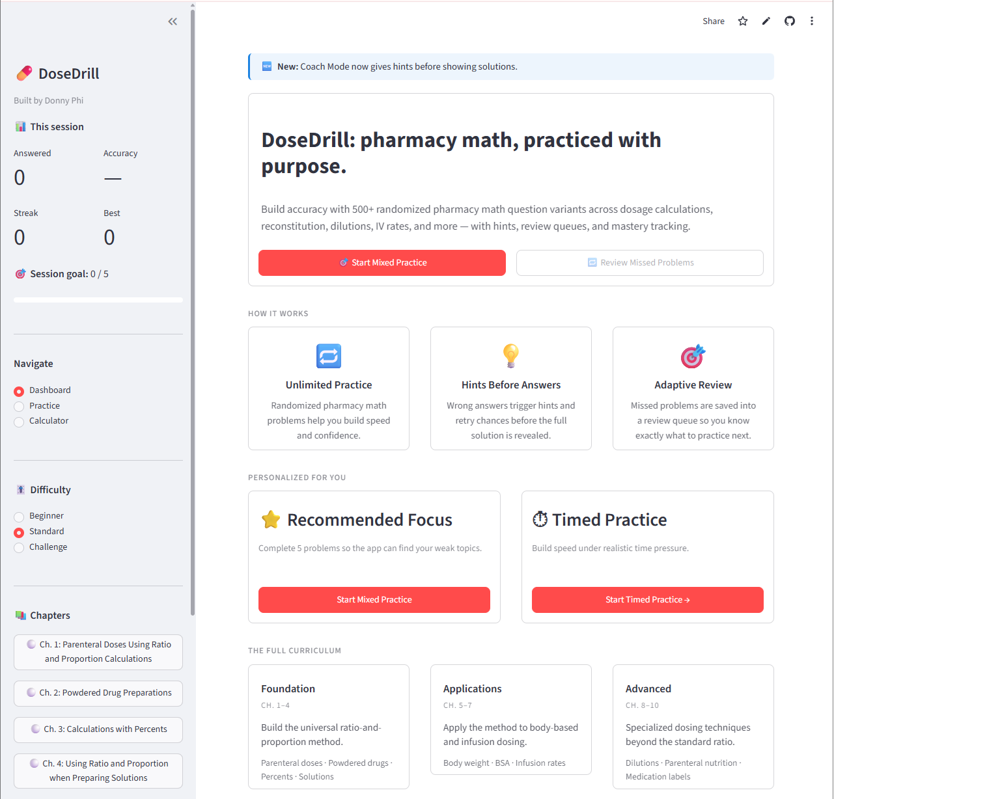

# PharmTech Math Lab

A Streamlit app that helps pharmacy technician students practice dosage calculations and certification-style pharmacy math.

## Live Demo

https://donnyphi-dose-drill.streamlit.app/

## Dashboard

## Why I Built This

Built for my pharm-tech cohort ahead of the June certification exam.

## Features

* Practice problems for pharmacy technician math
* Chapter-based review by topic
* Mixed practice mode
* Instant feedback with explanations
* Progress and accuracy tracking
* Recommended focus areas based on performance
* Built-in calculator/reference support

## Topics Covered

* Parenteral dosage calculations
* Powdered medications
* Percent strength
* Solution calculations
* Body weight dosing
* Body surface area
* Infusion rates
* Dilutions
* Pediatric/neonatal calculations
* Pharmacy labels

## Tech Stack

* Python
* Streamlit
* Pandas
* GitHub
* Streamlit Community Cloud
  

## Author

Built by Donny Nguyen
